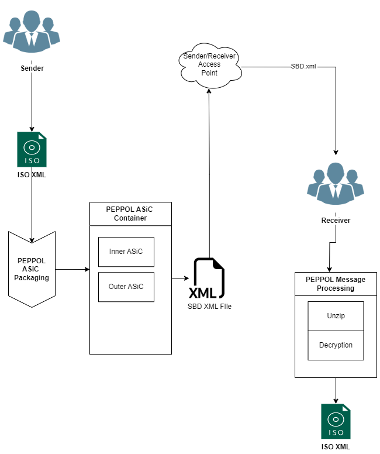
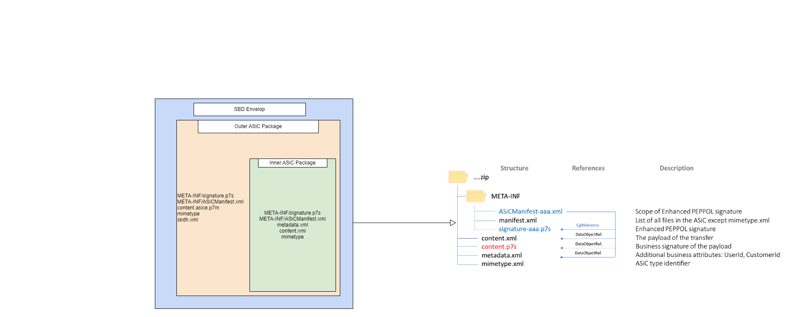
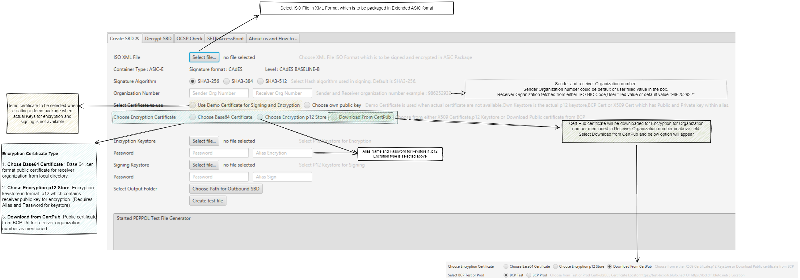
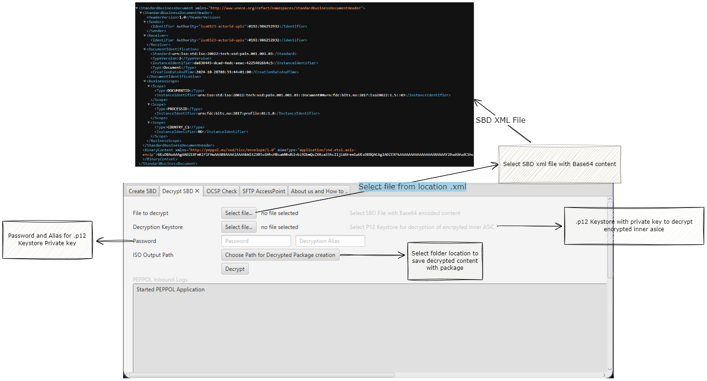

# EPEPPOL Standalone Application DFØ

## Table of content

1. [Information](#Information)
2. [Scope of Application](#ScopeofApplication)
3. [Requirement and How to run](#Requirement)
4. [PEPPOL Digital Application module](#PEPPOLDigitalApplicationmodule)
5. [Important Link](#ImportantLink)


<a name="Acronyms"></a>
## List of acronyms

| Acronym     | Description|
| -----------        | ----------- |
| ASiC-e             | Associated Signature Containers – extended     |
| PEPPOL             | Pan-European Public Procurement Online    |
| SBDH               | Single Business Document Header   |
| SBD                | Single Business Document  |
| SHA             | Secure Hash Algorithm   |
| BCP             | Business Certificate  Publisher   |
| BCL             | Business Certificate Locatior    |
| OCSP             | Online Certificate Status Protocol    |
| BCL             | Business Certificate Locatior    |

  


## Information

PEPPOL Standalone application is designed to demonstrate enhPEPPOL funcionality which is required as a security constraints , below are some functionality included in the application.

<a name="ScopeofApplication"></a>
## **Scope of Application**

### **Outbound**
    1. Creation of digital signature.
    2. Content encryption.
    3. BCP certificate download.
    4. OCSP verification.
    5. Packaging detached signatures.
    6. Packaging file in inner and outer asice zip container .
    7. SBD and SBDH creation

### **Inbound**

    1. Verifying SBD and SBDH integrity.
    2. Detached signature validation.
    3. ASiCManifest hash value validation.
    4. Content decryption.
    
## **Design**
### PEPPOL Outbound High Level

 

### PEPPOL ASiC-e Structure
PEPPOL ASiC-e Container consist of inner asice,outer asice and both these asice are packed as Base64 encoded content inside SBD.xml file.
 

### PEPPOL Digital Application Outbound
EPEPPOL Digital Application outbound provides interface to create SBD Package containing the ISO XML file in encrypted and signed format.

 Input = ISO XML File

 Output= SBD XML Package
 
 

### PEPPOL Digital Application Inbound
EPEPPOL Digital Application inbound provides interface to get ISO XML file from encrpyted SBD package using private key with which SBD file was encrpyted.

Input =SBD XML Package

Output= ISO XML File

 

<a name="Requirement"></a>
## Requirement and Steps to run application
 1. PEPPOL Digital application is standalone application which does not require any server to run the application.
 2. Application minimum requirement is Java 1.8..
    ### Steps to run application
    1. Download PEPPOL_Digital_Application_Run.zip
    2. Unzip directory.
    3. Run Application.bat

   

<a name="PEPPOLDigitalApplicationmodule"></a>
## PEPPOL Digital Application module 

1. **no.dfo.peppol.outbound.PeppolOutbound.java**: Outbound / SBD File creation process starts from here . Calls other java classes for processing file like Zipping,Base64 encoding , signing,encryption etc.

2. **no.dfo.peppol.common.ocsp.OCSPLookupApp.java** : Does OCSP verification of certificate passed in GUI or  through .p12 Keystore.

3. **no.dfo.peppol.outbound.sbdh.SBDHCreation** : Create the SBDH Document for Outer asice with given parameters through GUI. Below is sample SBDH XML Document which is created.

    ```
    <StandardBusinessDocumentHeader xmlns="http://www.unece.org/cefact/namespaces/StandardBusinessDocumentHeader">
    <HeaderVersion>1.0</HeaderVersion>
    <Sender>
    <Identifier Authority="iso6523-actorid-upis">0192:986252932</Identifier>
    </Sender>
    <Receiver>
    <Identifier Authority="iso6523-actorid-upis">0192:986252932</Identifier>
    </Receiver>
    <DocumentIdentification>
    <Standard>urn:iso:std:iso:20022:tech:xsd:pain.001.001.03</Standard>
    <TypeVersion>3</TypeVersion>
    <InstanceIdentifier>da838445-dcad-4edc-aeac-42254026b4c5</InstanceIdentifier>
    <Type>Document</Type>
    <CreationDateAndTime>2024-10-28T08:33:44+01:00</CreationDateAndTime>
    </DocumentIdentification>
    <BusinessScope>
    <Scope>
    <Type>DOCUMENTID</Type>
    <InstanceIdentifier>urn:iso:std:iso:20022:tech:xsd:pain.001.001.03::Document##urn:fdc:bits.no:2017:iso20022:1.5::03</InstanceIdentifier>
    </Scope>
    <Scope>
    <Type>PROCESSID</Type>
    <InstanceIdentifier>urn:fdc:bits.no:2017:profile:01:1.0</InstanceIdentifier>
    </Scope> 
    <Scope>
    <Type>COUNTRY_C1</Type>
    <InstanceIdentifier>NO</InstanceIdentifier>
    </Scope>
    </BusinessScope>
    </StandardBusinessDocumentHeader>   
    ```

4. **no.dfo.peppol.outbound.metadata.CreateMetadata** : Create Metadata.xml file in inner asice with dummy values. Below is sample metadata xml document created.

    ```
    <ns2:Metadata xmlns:ns2="urn:fdc:difi.no:2017:payment:extras-1">
    <Version>1.0</Version>
    <CustomerIdentifier>Test</CustomerIdentifier>
    <DivisionIdentifier>Test1</DivisionIdentifier>
    <UserIdentifier>Test2</UserIdentifier>
    </ns2:Metadata>
    ```
5. **no.dfo.peppol.outbound.signing.SignASiCwithCAdES.signASiCSBaselineB()**: Function to create detached signature for list of documents to sign with below parameters. Sets the filename for Signing document and the detached signature.

    1. signatureParameters.setSignatureLevel(SignatureLevel.CAdES_BASELINE_B); 

    2. signatureParameters.aSiC().setContainerType(ASiCContainerType.ASiC_E); //Container Type

    3. signatureParameters.setDigestAlgorithm(uvg.getSignatureDigest());  // DigestAlgorithm.SHA256

    4. signatureParameters.setEncryptionAlgorithm(EncryptionAlgorithm.ECDSA); //Signature Algorithm

6. **no.dfo.peppol.outbound.crypto.CMSEncryptData** : Encrypt the inner asice with OAEP Parameters (RSAOAEP with mgf1 and SHA256) and key encryption algorithm AES256-GSM

    ```
    OAEPParameterSpec oaepSpec = new OAEPParameterSpec("SHA-256", "MGF1", MGF1ParameterSpec.SHA256, PSource.PSpecified.DEFAULT);
    OutputEncryptor encryptor = (new JceCMSContentEncryptorBuilder(CMSAlgorithm.AES256_GCM)).setP
    ```

7. **no.dfo.peppol.outbound.BCLCertLoader** : To download public certificate from BCP which is used in Encrpytion. 

    1. BCL : Provides BCP URL for certificate provider for customer or banks.

    2. BCP : Public certificate is store in BCP in Base 64 format

8. **no.dfo.peppol.outbound.PeppolOutbound.createStandardBusinessDocument(String sbdh, String binaryContent)** : SBD Document is created with content from SBDH and  BASE 64 encoded zip file content . Below is sample for sbd.xml file created .Binary content replace with “……..” for readability.


    ```
    <StandardBusinessDocument xmlns="http://www.unece.org/cefact/namespaces/StandardBusinessDocumentHeader">
    <StandardBusinessDocumentHeader>
    <HeaderVersion>1.0</HeaderVersion>
    <Sender>
    <Identifier Authority="iso6523-actorid-upis">0192:986252932</Identifier>
    </Sender>
    <Receiver>
    <Identifier Authority="iso6523-actorid-upis">0192:986252932</Identifier>
    </Receiver>
    <DocumentIdentification>
    <Standard>urn:iso:std:iso:20022:tech:xsd:pain.001.001.03</Standard>
    <TypeVersion>3</TypeVersion>
    <InstanceIdentifier>da838445-dcad-4edc-aeac-42254026b4c5</InstanceIdentifier>
    <Type>Document</Type>
    <CreationDateAndTime>2024-10-28T08:33:44+01:00</CreationDateAndTime>
    </DocumentIdentification>
    <BusinessScope>
    <Scope>
    <Type>DOCUMENTID</Type>
    <InstanceIdentifier>urn:iso:std:iso:20022:tech:xsd:pain.001.001.03::Document##urn:fdc:bits.no:2017:iso20022:1.5::03</InstanceIdentifier>
    </Scope>
    <Scope>
    <Type>PROCESSID</Type>
    <InstanceIdentifier>urn:fdc:bits.no:2017:profile:01:1.0</InstanceIdentifier>
    </Scope>
    <Scope>
    <Type>COUNTRY_C1</Type>
    <InstanceIdentifier>NO</InstanceIdentifier>
    </Scope>
    </BusinessScope>
    </StandardBusinessDocumentHeader>
    <BinaryContent xmlns="http://peppol.eu/xsd/ticc/envelope/1.0" mimeType="application/vnd.etsi.asic-e+zip">UEsDBAoAAAgAADZEXFmKIflFHwAAAB8AAAAIAAAAbWltZXR5cGVhcHBsaWNhdGlvbi92bmQuZXRzaS5hc2ljLWUremYR5HzKDmfwkj9BqpIdpwHxsbzIUhtGAWj1X80RPcSmvMOlvVFdeHsmBAK1irAtzOPAqnb5HcgjfPeZdIkkNyDzh5gIjBIVcW+Ya6SPoctE53nACWfdvrrHm4bcz52MdOKbvr71+sNuJ+sixIuSX/fnOvuMMgzdECLQA2vJJv3GUsEm3.........................bDjVygExykXTQMunpF8KXVEEKH3KBjODVeOVon4GcXGUPixGmBW7eGoBntg5UzXR4WCHug1ISnfhPrtkF8N1eARnecW2wHDtRuaNjGYnVXSFLidvNplgwuR4p3YURiuOZ3BCqcPZljkMk8vTLVoheomTGOGn9VAo1F9bEWzEaZcj8CT1bAOndqJw/VgAAAAAAAAAAAAA7ysAAE1FVEEtSU5GL0FTaUNNYW5pZmVzdC1EQlQzQTI0MDkyMDEueG1sUEsFBgAAAAAFAAUAUAEAAMwtAAAAAA==</BinaryContent>
    </StandardBusinessDocument>
    ```

9. **no.dfo.peppol.inbound.inboundMain.PeppolInbound** : Function to sign verify and decryption of SBD file starts here which calls classes for different operation like Base64 decode,unzipping,signature verification ,decryption etc.

10. **no.dfo.peppol.inbound.inboundMain.PeppolInbound.getBinaryContent(Document doc)** : Takes Binary base64 encoded content from input sbd.xml file.

11. SBD.xml Equals to SBDH.xml for integrity(**no.dfo.peppol.inbound.inboundMain.PeppolInbound**)


    ```
    Log.info("["+uv.getFilename()+"_"+uvg.getTimestamp()+"]"+"SBD Comparision Start SBD and SBDH " );
    String compSBD=doc.getElementsByTagName("StandardBusinessDocumentHeader").item(0).getTextContent().trim().replaceAll("\\s", "");
    DocumentBuilderFactory sbdhComparision = DocumentBuilderFactory.newInstance();
    sbdhComparision.setNamespaceAware(true);
    sbdhComparision.setFeature(XMLConstants.FEATURE_SECURE_PROCESSING, true);
    DocumentBuilder buildersbdhComparision = sbdhComparision.newDocumentBuilder();
    Document sbdhComparisionDoc = buildersbdhComparision.parse(IOUtils.toInputStream(SBDH,"UTF-8"));
    String compSBDH=sbdhComparisionDoc.getElementsByTagName("StandardBusinessDocumentHeader").item(0).getTextContent().trim().replaceAll("\\s", "");
    if(compSBD.equals(compSBDH)) {
        Log.info("["+uv.getFilename()+"_"+uvg.getTimestamp()+"]"+"SBD and SBDH Outer are Equal." );
    }else {
        throw new Exception("SBD and SBDH Comparision Failed ");
    }
    Log.info("["+uv.getFilename()+"_"+uvg.getTimestamp()+"]"+"SBD Comparision E
    ```

12. **no.dfo.peppol.outbound.asicmanifestreader.AsicManifestReader** : Class which reads ASiCManifest.xml for signed file and hash values of file .

    a. no.dfo.peppol.outbound.asicmanifestreader.AsicManifestReader.readOuterAsicmanifest

    b. no.dfo.peppol.outbound.asicmanifestreader.AsicManifestReader.readInnerAsicmanifest

Sample ASiCManifest.xml below

```
    <ASiCManifest xmlns="http://uri.etsi.org/02918/v1.2.1#" xmlns:ns2="http://www.w3.org/2000/09/xmldsig#">
    <SigReference MimeType="application/x-pkcs7-signature" URI="META-INF/signature-VV~DNVVA2410014~215.p7s"/>
    <DataObjectReference MimeType="application/xml" URI="content.xml">
    <ns2:DigestMethod Algorithm="http://www.w3.org/2001/04/xmlenc#sha256"/>
    <ns2:DigestValue>aKLhKljLm7B1eypn0QsCaRgsd7fOOwUo5gyuAe5Rh5Q=</ns2:DigestValue>
    </DataObjectReference>
    <DataObjectReference MimeType="application/xml" URI="metadata.xml">
    <ns2:DigestMethod Algorithm="http://www.w3.org/2001/04/xmlenc#sha256"/>
    <ns2:DigestValue>r921wXvRUy8ukuvNudISa/Nmg7IIJa+oF1eH+t7DSKU=</ns2:DigestValue>
    </DataObjectReference>
    </ASiCManifest>
```


13. **no.dfo.peppol.outbound.asicmanifestreader.CalculateHash** : Function to calculate hash value of the files in URI path from ASiCManifest.xml file (Signature and Metadata,content.asice.p7m)
Supported algorithm : 

    ``` 
    SHA3-256,SHA256,SHA3-512,SHA3-384
    ```

14. **no.dfo.peppol.inbound.signverification.SignatureVerifier** : Verifies detached signature with the signed ASiCManifest.xml file and return the status true or false

    ```
    boolean verificationRes=snSignatureVerifier.SignVerify(ASicFile, signatureFile,"Outer_Asic");
    ```


15. **no.dfo.peppol.inbound.crypto.CMSDecrypt** : Class to decrypt the encrypted content.asice.p7m file with private key .

    ```
                CMSEnvelopedDataParser envelopedData = new CMSEnvelopedDataParser(encryptedData);
                Collection<RecipientInformation> recip = envelopedData.getRecipientInfos().getRecipients();
                RecipientInformation recipientInfo = recip.iterator().next();
                decrypedInputStream=recipientInfo.getContentStream(new JceKeyTransEnvelopedRecipient(decryptionKey).setAlgorithmMapping(PKCSObjectIdentifiers.id_RSAES_OAEP, "RSA/GCM/OAEPWithSHA256AndMGF1Padding").setProvider("BC").setContentProvider("BC")).getContentStream();
    ```


## **Resources**
1. Demo KeyStore : [PEPPOLStandalone/resources/DemoKeys.p12](PEPPOLStandalone/resources/DemoKeys.p12) 
2. Test ISO File : [Resource/TestFiles/ISO_Test_File.xml](Resource/TestFiles/ISO_Test_File.xml)
3. SBD File : [Resource/TestFiles/SBD_Package/986252932_920058817_15012025171826129_ISO_Test_File.xml](Resource/TestFiles/SBD_Package/986252932_920058817_15012025171826129_ISO_Test_File.xml)
4. Inner ASiC-e Zip container:[Resource/TestFiles/SBD_Package/ISO_Test_File.xml_inner.zip](Resource/TestFiles/SBD_Package/ISO_Test_File.xml_inner.zip)
5. Outer ASiC-e Zip container:[Resource/TestFiles/SBD_Package/ISO_Test_File.xml_outer.zip](Resource/TestFiles/SBD_Package/ISO_Test_File.xml_outer.zip)

 <a name="ImportantLink"></a>
## **Important Link**
| Type      | URL Link |
| ----------- | ----------- |
| DSS Application Document PDF           | [Digital Signature Service](https://ec.europa.eu/digital-building-blocks/DSS/webapp-demo/doc/dss-documentation.pdf)       |
| DSS Application Git Hub repository     | [GitHub - esig/dss-demonstrations: Examples of DSS integration](https://github.com/esig/dss-demonstrations)       |
| DSS WebApp                             | [DSS Demonstration WebApp](https://ec.europa.eu/digital-building-blocks/DSS/webapp-demo/sign-a-document)         |
| PEPPOL Rulebook                        |  [Rulebook](https://anskaffelser.dev/payment/g1/docs/current/rulebook/)           |
| PEPPOL Security Requirement            | [Security requirements for secure file transactions](https://anskaffelser.dev/payment/g1/docs/current/security/)         |
| Use of (enhanced) PEPPOL eDelivery network   | [20170119 Use of PEPPOL eDelivery network for ISO 20022 v_1.pdf](https://anskaffelser.dev/payment/g1/files/20170119%20Use%20of%20PEPPOL%20eDelivery%20network%20for%20ISO%2020022%20v_1.pdf)                |


> # Disclaimer
DFØ is not responsible for any problems this application may cause for those who may use it, and users of the application are responsible for carrying out continuous security checks/scans while using this application.

The DSS project is delivered under the terms of the Lesser General Public License (LGPL), version 2.1.

DFØ's extension to the DSS project (Refer to DSS WebApp in above resource reference) is meant as general guidance only in regard to the subject matter covered and does not constitute any advice or recommendation.

DFØ makes no warranties or representations either expressed or implied about correctness, accuracy, timeliness or completeness of the application content and may discontinue distributing the application on Github without prior notice.


